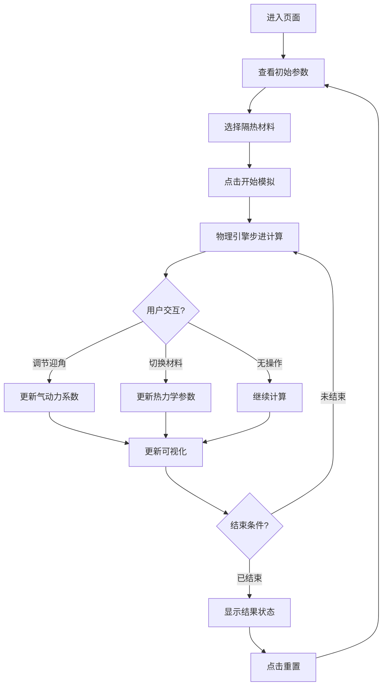

## 1. 产品概述

航天器再入大气层交互式物理模拟器，通过可视化和实时参数调节，让用户直观体验飞行器再入过程中的气动加热、轨迹变化、隔热材料选择等关键工程问题。

- 主要目的：教育演示与工程直觉培养，面向航天爱好者、学生、工程人员
- 产品价值：将抽象的空气动力学与热力学概念转化为可交互、可调节的直观体验

## 2. 核心特性

### 2.1 功能模块

1. **主可视化画布**：2D 侧视再入轨迹、气动加热红橙光晕、飞行器姿态
2. **飞行参数仪表板**：实时显示高度、速度、马赫数、舱内温度、隔热层状态
3. **迎角控制面板**：滑块调节飞行器迎角 (-15° ~ +40°)，实时影响升力、阻力、加热率
4. **隔热材料选择器**：
   - 烧蚀材料（PICA、酚醛树脂）：消耗自身但隔热效果好
   - 热容材料（金属合金、陶瓷）：吸热但存在饱和上限
   - 辐射散热材料（增强碳碳）：高温辐射散热但低温效果差
5. **模拟控制**：开始/暂停/重置、模拟速度倍率切换

### 2.2 页面详情

| 页面名称 | 模块名称 | 功能描述 |
|---------|---------|---------|
| 主页面 | 顶部标题区 | 产品名称 + 副标题介绍 + 主题视觉装饰 |
| 主页面 | 左侧画布区 | 2D 侧视轨迹图，大气层分层、地球曲率、飞行器轨迹、加热光晕 |
| 主页面 | 右侧仪表板 | 高度、速度、马赫数、G 力、舱内温度、隔热层厚度/剩余量 |
| 主页面 | 底部控制区 | 迎角滑块、材料选择卡片、播放/暂停/重置按钮、速度倍率 |

## 3. 核心流程

用户打开页面 → 查看初始参数 → 点击「开始模拟」→ 飞行器从 120km 高空以 11km/s 进入大气层 → 用户实时调节迎角和切换材料 → 观察轨迹、加热、舱内温度变化 → 模拟结束（成功着陆/隔热层失效/烧毁）→ 重置或重新调节参数再次模拟

## 4. 用户界面设计

### 4.1 设计风格

- **主色调**：深空黑 (#0a0e1a) 背景 + 火焰橙红 (#ff5722, #ff9800, #ffc107) 渐变 + 冷钢蓝 (#3b82f6, #60a5fa) 仪表文字
- **次要色**：大气层蓝紫渐变（高空深蓝 #1e1b4b → 低空蓝灰 #64748b），地表深绿 #14532d
- **按钮风格**：3D 微浮雕、圆角 8px、悬停发光、禁用态灰化
- **字体选择**：
  - 标题：Orbitron（航天科技感等宽装饰字体）
  - 正文：JetBrains Mono（数据显示等宽字体）+ Noto Sans SC（中文说明）
- **布局风格**：三栏式（左大画布 + 右上仪表 + 右下控制），深色仪表盘风格，发光边框，玻璃拟态面板
- **视觉元素**：扫描线、网格、发光指示灯、数据微抖动动画

### 4.2 页面设计概览

| 页面名称 | 模块名称 | UI 元素 |
|---------|---------|---------|
| 主页面 | 顶部标题 | Orbitron 大标题发光文字、分隔线、副标题说明 |
| 主页面 | 2D 画布 | 大气层分层渲染、地球圆弧、轨迹线（速度颜色编码）、飞行器 SVG、加热粒子系统、坐标网格 |
| 主页面 | 仪表面板 | 发光数字显示、进度条（温度、隔热层）、趋势迷你图、状态指示灯 |
| 主页面 | 控制面板 | 带刻度滑块、材料卡片（点击选中高亮）、图标按钮、状态标签 |

### 4.3 响应式

- 桌面优先设计（最小宽度 1280px）
- 平板：控制区移至底部
- 移动端：单列布局，画布缩放到合适尺寸

### 4.4 视觉特效指导

- **气动加热**：飞行器前方多层径向渐变光晕（红→橙→黄），大小和强度随加热率变化，附带向上飘散的火焰粒子
- **轨迹线**：颜色从高速蓝紫 → 中速橙 → 低速绿，带拖尾渐隐效果
- **数据变化**：数值变化时微跳动 + 颜色闪烁（高温变红，低温变蓝）
- **材料消耗**：烧蚀材料进度条有碎屑剥落粒子效果
