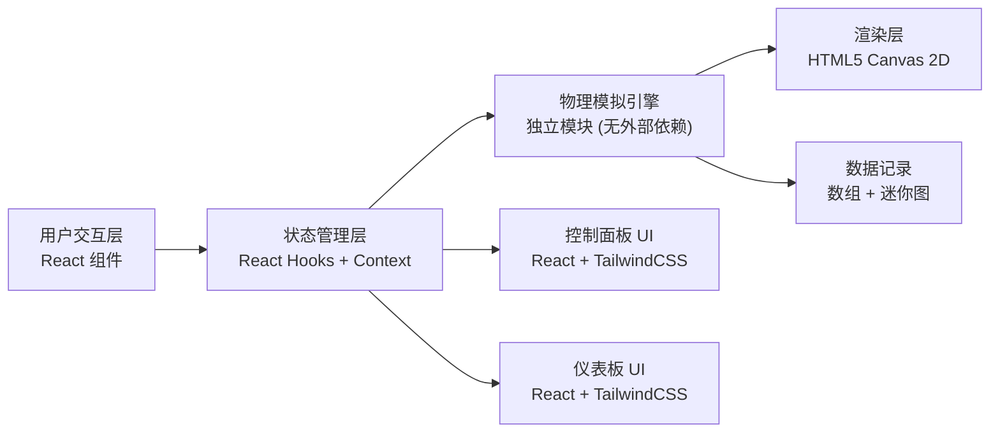

## 1. 架构设计



## 2. 技术说明

- **前端框架**：React@18 + Vite@5
- **样式方案**：TailwindCSS@3 + 自定义 CSS 变量（主题色、动画关键帧）
- **渲染方案**：HTML5 Canvas 2D（高性能粒子系统和轨迹绘制），无需引入 Three.js
- **初始化工具**：`npm create vite@latest . -- --template react`
- **后端**：无（纯前端单页应用）
- **数据库**：无（所有数据内存态）
- **字体方案**：Google Fonts CDN 引入 Orbitron、JetBrains Mono、Noto Sans SC

## 3. 路由定义

| 路由 | 用途 |
|-----|------|
| / | 主页面（唯一页面），包含画布、仪表、控制三大区域 |

## 4. 模块划分与文件结构

```
src/
├── main.jsx              # 入口
├── App.jsx               # 顶层布局，组装三大区域
├── index.css             # Tailwind 指令 + 全局样式 + CSS 变量 + 动画
├── engine/
│   └── physics.js        # 物理模拟核心：再入动力学、气动加热、隔热材料模型
├── hooks/
│   └── useSimulation.js  # React Hook：封装模拟循环、状态管理
├── components/
│   ├── Header.jsx        # 顶部标题区
│   ├── Canvas2D.jsx      # 2D 画布组件（Canvas 渲染）
│   ├── Dashboard.jsx     # 飞行参数仪表板
│   ├── ControlPanel.jsx  # 底部控制面板（迎角滑块 + 材料卡片 + 播放按钮）
│   ├── Gauge.jsx         # 通用仪表数字显示组件
│   ├── ProgressBar.jsx   # 通用进度条（温度/隔热层）
│   └── MaterialCard.jsx  # 隔热材料选择卡片
└── data/
    └── materials.js      # 隔热材料数据库（PICA、酚醛、金属合金、陶瓷、碳碳等）
```

## 5. 核心数据模型

### 5.1 飞行器状态 (每帧更新)

```javascript
{
  altitude: number,      // 高度 (km)，0~120
  velocity: number,      // 速度 (m/s)，0~12000
  flightPathAngle: number, // 飞行轨迹角 (弧度)，-π/2~0
  x: number,             // 水平距离 (km)
  pitch: number,         // 迎角 (弧度)，用户可调节 -15°~+40°
  mach: number,          // 马赫数 (自动计算)
  gForce: number,        // G 力 (自动计算)
  skinTemp: number,      // 表面温度 (K)
  cabinTemp: number,     // 舱内温度 (K)，安全上限 ~350K
  heatRate: number,      // 当前加热率 (W/m²)
  shieldRemaining: number, // 隔热层剩余 (0~1，烧蚀材料) 或 热容饱和度
  totalHeat: number,     // 累计总加热量 (J/m²)
  time: number,          // 模拟时间 (s)
}
```

### 5.2 隔热材料定义

```javascript
{
  id: string,
  name: string,
  type: 'ablative' | 'heatSink' | 'radiative', // 烧蚀型 / 热容型 / 辐射型
  thickness: number,      // 初始厚度 (mm)
  density: number,        // 密度 (kg/m³)
  specificHeat: number,   // 比热容 (J/kg·K)
  thermalConductivity: number, // 导热系数 (W/m·K)
  ablationHeat: number,   // 烧蚀潜热 (J/kg)，仅烧蚀型
  emissivity: number,     // 辐射率，仅辐射型
  maxTemp: number,        // 失效温度 (K)
  description: string,
}
```

### 5.3 物理常量

- 地球半径：`R_EARTH = 6371 km`
- 重力加速度（随高度）：`g(h) = g0 * (R_EARTH / (R_EARTH+h))²`，`g0 = 9.80665 m/s²`
- 大气模型：指数大气 `ρ(h) = ρ0 * exp(-h/H)`，标高 H=8500m，ρ0=1.225 kg/m³
- 声速：`a = sqrt(γ * R * T)`，γ=1.4, R=287 J/kg·K，T 随高度的标准大气模型简化
- 气动力：`L = 0.5*ρ*v²*S*CL(α, Ma)`，`D = 0.5*ρ*v²*S*CD(α, Ma)`
- 参考面积 S = 15 m²（类阿波罗飞船）
- 加热率：Sutton-Graves 公式简化 `Q = k * sqrt(ρ) * v^3 * f(α)`
- CL/CD 曲线：α=0 时 CD≈0.15，α=40° 时 CD≈1.2，CL 峰值在 α≈30°

## 6. 模拟循环逻辑

每帧 (requestAnimationFrame, 约 60fps)：
1. 根据速度倍率决定物理子步数 (典型 10 子步/帧，dt=0.01s)
2. 每个物理子步：
   - 由高度计算 ρ、T、声速 a、g
   - 计算 Ma = v/a
   - 由迎角 α 和 Ma 查表/插值得到 CL、CD
   - 计算升力 L、阻力 D
   - 运动方程：`dv/dt = -D/m - g*sin(γ)`，`dγ/dt = L/(m*v) + (g/v - v/(R+h))*cos(γ)`，`dh/dt = v*sin(γ)`，`dx/dt = v*cos(γ)`
   - 加热率 Q = k * sqrt(ρ) * v³ * (1 + 0.5*sin(α))
   - 隔热材料热力学计算（烧蚀/热容/辐射）
   - 更新舱内温度（简化热传导模型）
   - 检查结束条件（h<=0 成功；舱内温度>400K 失败；隔热层耗尽失败）
3. 把当前状态加入轨迹历史（保留最近 N=500 点用于画轨迹线）
4. 触发 React 状态更新 → 组件重渲染

## 7. Canvas 渲染方案

Canvas 尺寸约 1000×600，坐标系：
- 水平轴：x（水平距离，0~3000km，线性）
- 垂直轴：h（高度，0~130km，线性，向上为正）
- 左下角为 (x=0, h=0)，左上角为 (x=0, h=130)

渲染层次（从下到上）：
1. 深空黑背景 + 星星（随机白点微闪烁）
2. 地球圆弧（底部，填充深绿/蓝色渐变）
3. 大气层分层（<12km 对流层、12~50km 平流层、50~85km 中间层、85~600km 热层，每层不同透明度的蓝紫渐变）
4. 坐标网格 + 刻度标注
5. 轨迹历史折线（按速度映射颜色，带渐隐拖尾）
6. 气动加热光晕（飞行器前方径向渐变，多层，透明度随加热率）
7. 火焰粒子（从加热区域生成，向上飘散，生命周期）
8. 飞行器 SVG/多边形（根据迎角旋转，加热面红色渐变发光）
9. 速度矢量箭头（可选调试显示）

## 8. 性能优化

- Canvas 渲染独立于 React，使用 useRef 访问 DOM，避免每帧触发 VDOM
- 物理引擎纯函数，无 React 依赖，子步计算高效
- 轨迹历史环形缓冲区，固定长度避免数组膨胀
- 粒子系统对象池，复用粒子对象减少 GC
- 仪表板状态节流更新（每 2~3 帧更新一次 React 状态，避免过度重渲染）
